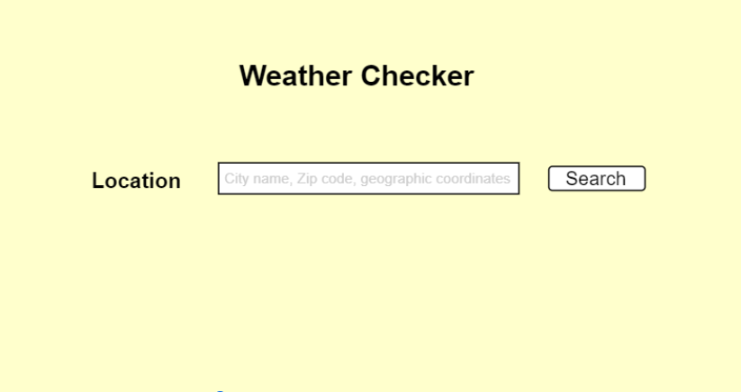
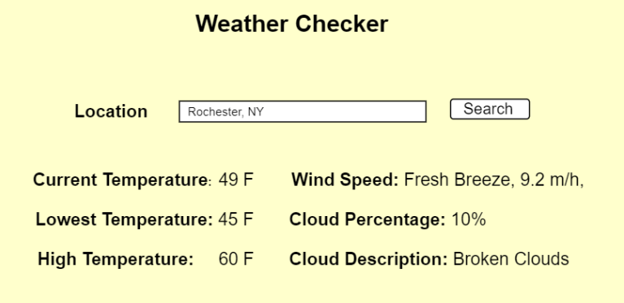
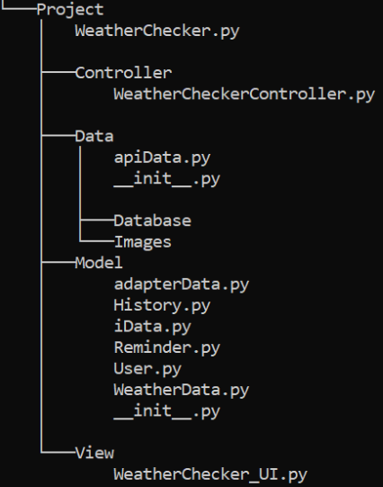
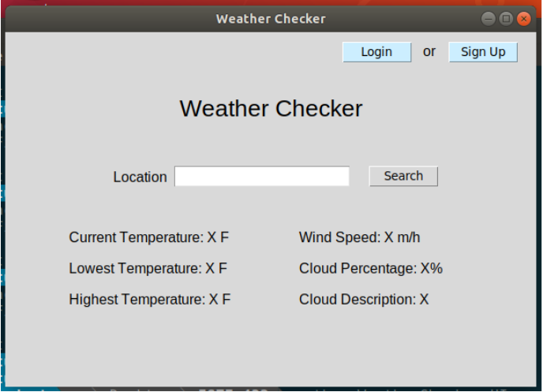
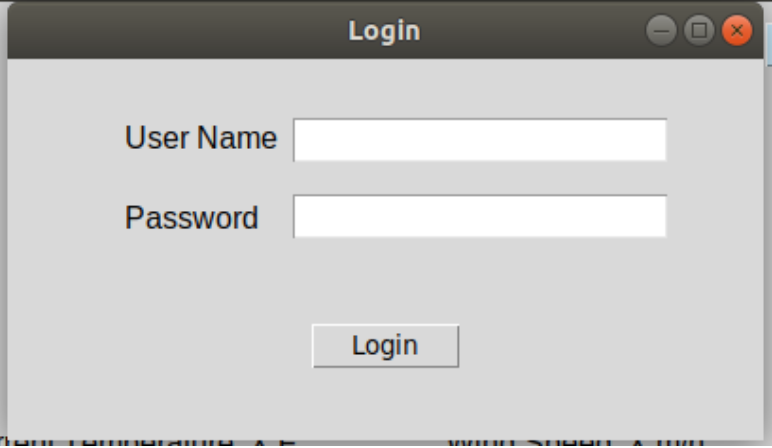
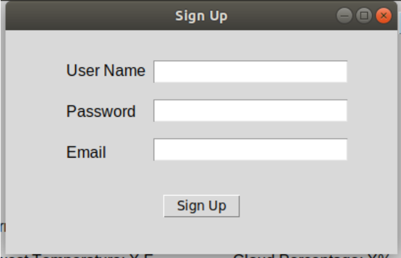

# Development Book
###### ISTE 432 – Database Application Development
###### Zhimin Lin & Feng Lin
----------------------------------------------------
#### Team Members and Roles
Zhimin Lin - Developer
Feng Lin – Developer

#### Background
Most of the weather applications or channels include so many complex functions, like a graph for temperature difference in one day, etc. Those functions are great but for some older people simple is the best. So, we like to develop an easy-to-use application for older people to check the weather. 
 
 
#### Project Description
For this project, we would like to develop an application that allows the user to check the current weather data for over 200,000 cities by giving either city name, zip code or geographic coordinates. Weather data include current temperature, highest temperature, lowest temperature, wind speed, cloud percentage, cloud description, and humidity.
 
On the application, there will be more functions besides the basic checking weather information if user sign-up with their name and email address. Additional functions include set reminders, displays and view/search history. 
	
	
#### Project Requirements
1. The application needs to be user-friendly.
2. The application needs to be easy-to-use.
3. Provide accurate temperature and weather information to the user.
4. Require a sign-up function for user
5. Able to save user view/search history.
6. User is able to set a circulation reminder for sending weather information 7. to their email.
8. Require a database for username personal information.
9. Require a database for weather information. 
10. Require a database for user view/search history.
 
 
#### Business Rules
1. User must provide information about the location that he/she likes to check the weather.
2. Programable to return accurate weather information depending on the user input.
3. The program will search for weather information depending on the user input, if no results found, an error message like “Location not found” will show.  
 
 
#### Technologies Used
1. REST API - Use REST API technology to collect temperature data from OpenWeather (https://openweathermap.org/). 
2. Developed Python QtGUI.

-----------------------------------------------------------------------------------

#### Design Pattern
1. Observer Pattern will notify our application of anything change in the API. 
Example: Current Temperature. 
2. Adapter Pattern will work as a wrapper between two objects, by combining two independent interfaces.
```python
import requests
# Adaptee
class Weatherdata():
	def alldata(self):
		url = 'https://api.openweathermap.org/data/2.5/weather?q=Brooklyn&appid=a43ce9d89cbceb4d0d7885c7e1476c55'
		data = {'header': 'Content-Type: application/json'}
		r = requests.get(url,data=data)
		data = r.json()
		return data 
		
# Target interface
class DataInterface:
    def alldata(self): pass
    
# The Adapter
class Adapter(DataInterface):
    interface = None
    def __init__(self, data):
        self.interface = data

    def alldata(self):
        return self.interface.alldata()
        
# Client
class Getdata:
    datainfo = None
    def __init__(self, data):
        self.datainfo = data

    def dataprint(self):
        print self.datainfo.alldata()
def main():
    data  = Weatherdata()
    adapter = Adapter(data)
    printdata  = Getdata(adapter)

    printdata.dataprint()
    return 0

if __name__ == "__main__":
    main()
```

3. UI Pattern recurring solution to common problems in UI design. We are trying to make every page clean, easy-to-use, and friendly. Here are two parts of our framework for our project:

<p align="center">
	 
</p>

4. MVC stands for Model View Controller. MVC pattern will separate the program into three different layers. 
    - Data layer: Requesting data from API and get or insert data into the database. 
    - Application layer:  Managing data. 
    - Presentation layer: Communicating with the end-user. 

<p align="center">
	
 </p>
 
 ------------------------------------------------------------------------
 
#### Timeline
|Milestone  | Due Date |
|---|---|
|Milestone 1 - Requirement | Sep 15, 2019 11:59 PM |
|Milestone 2 - Design | Oct 4, 2019 11:59 PM |
|Milestone 3 - Layering | Oct 11, 2019 11:59 PM|
|Milestone 4 - Hashing | Oct 25, 2019 11:59 PM|
|Milestone 5 - Refactoring | Nov 8, 2019 11:59 PM|
|Milestone 6 - Testing | Nov 22, 2019 11:59 PM|
|Milestone 7 - Packaging | Dec 6, 2019 11:59 PM|

|Data | Updated|
|---|---|
|10/01/2019 | Development book created|
|10/03/2019 | Milestone 2 added - Design Pattern|
|10/11/2019 | Milestone 3 added - Layering|
|10/24/2019 | Milestonr 4 added - Exception|

------------------------------------------------------------

#### Layering
##### Presentation Layer:
Presentation layer is a representation of information and responsible to deliver data to the application layer.
WeatherChecker.py - This python file configures the user interface then collects user input.
```python
def loginUI():
	global login
	login = Tk() 
	login.title('Login')
	login.geometry("400x200+200+130") 

	usernameLabel = Label(login,text="User Name",font=("Helvetica", 12))
	usernameLabel.place(x=60,y=30)

	usernameTextField = Text(login)
	usernameTextField.place(x=150,y=30, height=25, width=200)

	passwordLabel = Label(login,text="Password",font=("Helvetica", 12))
	passwordLabel.place(x=60,y=72)

	passwordTextField = Text(login)
	passwordTextField.place(x=150,y=70, height=25, width=200)

	loginButton = Button(login,text="Login", command=checkLogin)
	loginButton.place(anchor=CENTER, x=200,y=150, height=25, width=80)

	login.mainloop() 

def signUpUI():
	signUp = Tk() 
	signUp.title('Sign Up')
	signUp.geometry("400x230+200+130") 

	usernameLabel = Label(signUp,text="User Name",font=("Helvetica", 12))
	usernameLabel.place(x=60,y=30)

	usernameTextField = Text(signUp)
	usernameTextField.place(x=150,y=30, height=25, width=200)

	passwordLabel = Label(signUp,text="Password",font=("Helvetica", 12))
	passwordLabel.place(x=60,y=72)

	passwordTextField = Text(signUp)
	passwordTextField.place(x=150,y=70, height=25, width=200)

	emailLabel = Label(signUp,text="Email",font=("Helvetica", 12))
	emailLabel.place(x=60,y=114)

	emailTextField = Text(signUp)
	emailTextField.place(x=150,y=110, height=25, width=200)

	signupButton = Button(signUp,text="Sign Up", command=signUp.destroy)
	signupButton.place(anchor=CENTER, x=200,y=180, height=25, width=80)	

	signUp.mainloop() 
```
User interface looks like this:

<p align="center">
	  
</p>

##### Application Layer:
This is a layer that gets the user input from the presentation layer and gets the data back from the data layer. 
WeatherData.py- Its file takes the user input, then sends the user input to the data layer, data layer will return a JSON, then it will process the data and return to the presentation layer.
```python
from Data.apiData import *
from adapterData import *

class Getdata:
    datainfo = None
    weatherinfo=None
    def __init__(self, data):
        self.datainfo = data

    def processData(self):
        data=self.datainfo.alldata()
        minTemp=(int(data['main']['temp_min'])-273.15) * 9/5+32
        maxTemp=(int(data['main']['temp_max'])-273.15) * 9/5+32
        Temp = (int(data['main']['temp'])-273.15) * 9/5+32
        self.weatherinfo=[round(minTemp, 2), round(maxTemp, 2), round(Temp, 2), data['wind']['speed'], data['weather'][0]['description']]
        self.returnWeather()

    def returnWeather(self):
        return self.weatherinfo

def test():
    cityname = 'Brooklyn'
    getWeather=Weatherdata(1, cityname)
    adapter = Adapter(getWeather)
    printdata  = Getdata(adapter)
    printdata.processData()

if __name__ == "__main__":
    test()
```

iData.py- It’s  an interface which passes data from the data layer to application layer
```python
class DataInterface:
    def alldata(self): pass
```

adapterData.py- It takes the JSON from the interface to WeatherData.py when the data layer sends the JSON back.
```python
class Adapter():
    interface = None
    def __init__(self, data):
        self.interface = data

    def alldata(self):
        return self.interface.alldata()
```

reminder.py- Every day it will send an email to the user of the daily weather(only for users who have an account)

History.py- File to read the history of the user from the database and return to the presentation layer.

##### Data Layer:
A Layer delivers the data to the data layer.
apiData.py - A place to get the API data and return to the application layer.
```python
import requests

class Weatherdata():
    input = None
    option = None
    def __init__(self, option, input):
        self.input= input
        self.option =option
        
    def alldata(self):
        if self.option==1:
            url = 'https://api.openweathermap.org/data/2.5/weather?q=' + self.input + '&appid=a43ce9d89cbceb4d0d7885c7e1476c55'
            data = {'header': 'Content-Type: application/json'}
            r = requests.get(url, data=data)
            data = r.json()
        else:
            data=None
        return data

```

database.py- Reads the data from the database and return to the application layer.


#### Exception:
1. Wrong Username / Password
	- If the user enters the wrong username and password then display message "Wrong username/password. Please retry."

2. Database Connection Error
	- If the program can't connect to database then display message "Service Downtime. Please try again later."
	
3. API Connection Error
	- If API doesn't work or if the program is unable to connect API then display message "Service Downtime. Please try again later."
	

4. Invalid User Input
	- If the user enters an invalid input which contains any specical characters then display message "Invalid input. Please re-enter."
	- Example: User enters "Rocheste!!!r" for city name.
	
5. Data not found
	- If the user enters a city name which the API doesn't have any weather data for it or the user spells the input wrong then display message "No data found for this location. Please try other."
	- Example: User enters "Rohcester" for city name. 
	
```python
class handleException:
    option=1
    userinput=''

    def __init__(self, option, userinput):
        self.option = option
        self.userinput=userinput
        self.inputError

    def inputError(self):
        ## Handle error if user enter city name
        if (self.option == 1):
            if ',' in self.userinput:
                if self.userinput.replace(',', '').replace(' ', '').isalpha():
                    return True
                else:
                    return False
            elif self.userinput.isalpha():
                return True
            else:
                return False
        ## Handle error if user enter zip code
        if (self.option==2):
            if ',' in self.userinput:
                process=self.userinput.replace(' ', '')
                process=process.split(",")
                try:
                    int(process[0])
                except:
                    return False
                if not process[1].isalpha():
                    return False
            else:
                try:
                    int(self.userinput)
                except:
                    return False
            return True
        if (self.option == 3):
            if ',' in self.userinput:
                process = self.userinput.replace(' ', '')
                process = process.split(",")
                try:
                    float(process[0])
                    float(process[1])
                except ValueError:
                    return False
            else:
                return False
            return True

```

```python
def processData(self):
        data=self.datainfo.alldata()
        if 'message' in data:
            if 'Invalid API key' in data['message']:
                self.weatherinfo= "Service Downtime. Please try again later."
            if 'city not found' in data['message']:
                self.weatherinfo = "Invalid input. Please re-enter."
            if '400' in data['cod']:
                self.weatherinfo="Geographic coordinates not found. Please re-enter."
```

```python
import MySQLdb

class DB:
	try:
		db = MySQLdb.connect(host='localhost', user='root', passwd='student', db='weather')
		cur = db.cursor()
		cur.execute("select * from user;")
		result = cur.fetchall()
		print result
	except:
	    print("Service Downtime. Please try again later.")
```
 

#### Refactoring:
1. Our database has been updated from mySQL to Postgres DB
```sql
DROP DATABASE IF EXISTS userinfo;
CREATE DATABASE userinfo;
\c userinfo;

DROP TABLE if EXISTS users;
CREATE TABLE users(
	user_id SERIAL,
	username varchar(50),
	password varchar(50),
	PRIMARY KEY (user_id )
);
DROP TABLE if EXISTS history;
CREATE TABLE history(
	history_id SERIAL,
	user_id int,
	local_type int,
	address VARCHAR(50),
	PRIMARY Key(history_id)
);
DROP TABLE if EXISTS information;
CREATE TABLE information(
   user_id int,
   firstname VARCHAR(50),
   lastname VARCHAR(50),
   email VARCHAR(50),
   birth date,
   address varchar(50),
   PRIMARY Key(user_id)
);
```

2. Functions have been updated to work with Postgres DB
```python
import psycopg2

class Database:
	conn=None
	def connect(self):
		try:
			conn = psycopg2.connect(host='localhost', database='userinfo', port = "1996", user='postgres', password='student')
			return conn
		except (Exception, psycopg2.DatabaseError) as error:
			print(error)
			conn.close()
```

3. API response have been updated from a JSON string contains all data to a list only contains the data we want.
```python
    def processData(self):
        data = self.dataInfo.allData()
        if 'message' in data:
            if 'Invalid API key' in data['message']:
                self.weatherInfo = "Service Downtime. Please try again later."
            if 'city not found' in data['message']:
                self.weatherInfo = "Invalid input. Please re-enter."
            if '400' in data['cod']:
                self.weatherInfo = "Geographic coordinates not found. Please re-enter."
        else:
            minTemp = (int(data['main']['temp_min']) - 273.15) * 9 / 5 + 32
            maxTemp = (int(data['main']['temp_max']) - 273.15) * 9 / 5 + 32
            temp = (int(data['main']['temp']) - 273.15) * 9 / 5 + 32
            self.weatherInfo = [data['name'], round(minTemp, 2), round(maxTemp, 2), round(temp, 2), data['wind']['speed'], data['weather'][0]['description']]
```
 
 #### Testing:
 1. Test WeatherData funciton and validation of user input.
```python
from Model.WeatherData import *
from Model.handleException import *

def test():
    cityName = 'Brooklyn'
    option = 1

    handleError = handleException(option, cityName)
    if handleError.inputError():
        printdata = WeatherData(option, cityName)
        print printdata.getWeatherInfo()
    else:
        print "Invalidate input!"


if __name__ == "__main__":
```

2. Test verity, signUp and setInformaiton functions.  
```python
from UserData import *
getUser=UserData()
def test():
    print getUser.verify("fenglin","password")
    print getUser.signUp("fegli1", "password","Feng@gmail.com")
    print getUser.setInformation("Feng", "Lin", "1996-08-06", "Windish")
if __name__ == "__main__":
    test()
```

3. Test setUser, verifyUser and setUserInfo functions.
```python
from DB import *
getDB=Database()
def test():
    print(getDB.setUser("fenglin123", "password", "meial@gmail"))
    print(getDB.verifyUser("fenglin123"))
    print(getDB.setUserInfo("1", "Feng", "Lin", "1996-12-18","Windish"))
if __name__ == "__main__":
    test()
```


